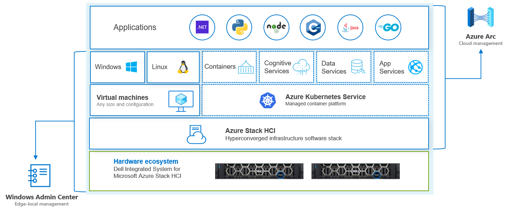

Dell Technologies & Microsoft | Hybrid Jumpstart
==============

## Welcome to the Hybrid Jumpstart
The goal of this jumpstart is to help you grow your knowledge, skills and experience around a number of core hybrid cloud solutions from the Dell Technologies and Microsoft hybrid portfolio. This ever-growing portfolio is infused with deep joint-engineering work, resulting in a set of integrated technologies that truly can transform and future-proof your business.

About the jumpstart
-----------
In this jumpstart, you'll learn about, and gain hands-on experience with a number of hybrid technologies within the Dell Technologies and Microsoft hybrid cloud portfolios. The following graphic depicts the different building blocks that make up the hybrid solution, and which you'll explore throughout the modules in this jumpstart:

There's a lot to digest in this graphic, so let's break down the different layers.

At the base, you have the foundation of this hybrid solution; **Azure Stack HCI**, the new purpose-built hyperconverged infrastructure operarting system from Microsoft, running on the enterprise-grade hardware platform from Dell Technologies, specifically, the **Dell Integrated System for Microsoft Azure Stack HCI**. This is managed through **Windows Admin Center**, which includes integration with **Dell OpenManage**, but in addition, there's growing integration with **Azure Arc** that you'll explore in this jumpstart. This hyperconverged solution is ideal for running traditional virtualized workloads, but in addition, virtual desktops, through integration with **Azure Virtual Desktop**.

In addition to traditional virtualized workloads, more and more organizations are exploring ways to modernize their applications - Kubernetes is an increasingly popular way to do this, yet Kubernetes is complex....unless you're using **Azure Kubernetes Service (AKS) hybrid**. With AKS hybrid, you really do have the "easy button" to deploy and manage Kubernetes on your infrastructure, and in this jumpstart, you'll see that first hand.

Finally, through the power of **Azure Arc**, you're able to bring a number of Azure services down from Azure, to run on your Kubernetes cluster - from **Cognitive Services** and **Data Services**, through to the ever-popular **Azure App Service**, these services can now be run inside your own environments, and in this jumpstart, you'll learn how. 

This is just the start - we'll continue to grow this repository as more and more features and funcionality appear in the technologies, and as more compelling scenarios are designed and delivered.

### Jumpstart Modules
This jumpstart takes a modular approach to education and experiences - it starts with a focus on the foundation of the hybrid offering, specifically Azure Stack HCI, before moving up the stack to cover solutions that focus more on your applications and workloads, including Kubernetes, Data services and PaaS platforms.

You are free to choose the modules that are most appropriate for your learning - for instance, after completing the initial Azure Stack HCI module, you could focus on a deeper experience with Azure Stack HCI, or alternatively, you could switch focus to containerization and explore the Kubernetes-focused modules. There's no right or wrong path!

After the **prerequsities** and **initial introductory** modules, the core focus will shift to Azure Stack HCI, including a number of hands-on exercises to help you experience the deployment and configuration of the solution.

From there, you're free to focus on the modules that are most appropriate to your goals.

#### Module 1 - Introduction - The Hybrid Landscape
In this module, we'll cover the hybrid landscape, why hybrid is so important to so many organizations, explore some of the core use cases and outline the overall hybrid solution from Dell Technologies and Microsoft.

#### Module 2 - Hybrid Infrastructure with Azure Stack HCI & Azure Arc
In this module, we'll dive deeper into Azure Stack HCI, including how it integrates with Dell OpenManage, and Azure. In addition, you'll explore a number of the core operations around Azure Stack HCI, including creating VMs, managing storage, networking, and integrating with a variety of Azure services. As part of this module, there are a number of hands-on-labs to explore the functionality of Azure Stack HCI.

#### Module 3 - Modernizing hybrid apps with Kubernetes & Azure Arc
We'll shift gears in this module, and start to focus more on applications, specifically, containerized applications. In this module, you'll explore AKS hybrid and learn first-hand how easy it is to deploy, and get up and running with your first containerized application. From there, you'll expore the Azure integration with Arc-enabled Kubernetes, GitOps, Azure Policy and more, all with hands-on-experience in the labs.

#### Module 4 - Modernizing hybrid apps with Azure Arc-enabled App Services
With AKS hybrid deployed, we'll continue our focus on applications, this time, looking more deeply at the Azure App Service, which is also now Arc-enabled. You'll learn what Arc-enabled App Service is all about, and in addition, go through a deployment of the solution, as well as some sample applications.

#### Module 5 - Modernizing hybrid apps with Azure Arc-enabled Data Services
One of the most important aspects of any application, is how you manage it's data. In this module, you'll explore the key capabilities of Azure Arc-enabled data services and learn how they are delivered down to your on-premises infrastructure, to provide an Azure-consistent means to managing your data footprint.

#### Module 6 - Embracing Cognitive Services with Azure Arc-enabled Machine Learning
In this module, you'll learn just what Azure Arc-enabled Machine Learning is, and how to configure and use your Azure Arc-enabled Kubernetes cluster to train, inference, and manage machine learning models in Azure Machine Learning.

#### Module 7 - Enhancing the hybrid workplace with Azure Virtual Desktop for Azure Stack HCI
One of the newest additions to the hybrid portfolio is Azure Virtual Desktop for Azure Stack HCI. In this module, you'll get a solid grounding on Azure Virtual Desktop, before we move into the specifics when running on top of Azure Stack HCI - you'll learn about deployment and management of your virtual desktop environment, and understand how the solution helps you to meet your performance or data locality needs.

### Is this jumpstart right for me?
The goal of this jumpstart is to immerse you in the hybrid solutions from Dell Technolgies and Microsoft. As part of the jumpstart, you'll be exposed to a number of more technically complex features and functionality across a number of the solutions. This will involve hands-on time with both GUI and Console/PowerShell-based interfaces. With that in mind, this jumpstart is aimed at, but by no means limited to:

- IT Professionals / Enthusiasts / Evangelists
- Operations Teams
- System / Infrastucture Administrators
- Technical Pre-Sales Roles

With that said, one goal of the jumpstart is to ensure that the more complex elements are simplified for broader audiences, so even if your role and experience doesn't fit with those previously mentioned, give the jumpstart a try, and provide us feedback on how we can make it better for you!

### How much time do I need?
Well, that depends :-) - The jumpstart is incredibly flexible, you can pick and choose the modules and hands-on-lab experiences that are most important for you. If you'd like to go deeper on the Azure Stack HCI specifics, focus your time and energy in that space, and there are several hours of content that can support your learning there. If you prefer to focus on the higher level app platforms and modernizing there, again, plenty of content is available for you to grow your skills.

If you wanted to walk through all the content and hands-on-labs, I'd **allocate at least one day** to walk through the different scenarios.

Getting Started
-----------
If you're ready to start your learning, head on over to the first module, to familiarize yourself with the hardware/software requirements for the jumpstart, and learn more about the tooling you'll use to deploy the solutions, most specifically, MSLab.

**Head over to the [Hybrid Jumpstart | Infrastructure Prerequisites](/modules/module_0/1_infra_prerequisites.md)**

Raising issues
-----------
If you notice something is wrong with the jumpstart, such as a step isn't working, or something just doesn't make sense - help us to make this guide better!  [Raise an issue in GitHub](https://github.com/DellGEOS/HybridJumpstart/issues), and we'll be sure to fix this as quickly as possible!

Contributions & Legal
-----------

### Contributing
This project welcomes contributions and suggestions - if you have edits, or wish to provide feedback, please feel free to do so - we'll incorporate any changes that can improve the overall experience for all users! Make sure you read the [contributing guidance](.github/CONTRIBUTING.md) before submitting!

### Legal Notices

You are granted a license to the content in this repository under the [Apache License 2.0](http://www.apache.org/licenses/LICENSE-2.0), see the [LICENSE](LICENSE) file.

Dell Technologies, Dell and other trademarks referenced in the jumpstart guidance are trademarks of Dell Inc. or its subsidiaries.

Microsoft, Windows, Microsoft Azure and/or other Microsoft products and services referenced in the jumpstart guidance may be either trademarks or registered trademarks of Microsoft in the United States and/or other countries.

The licenses for this project do not grant you rights to use any Microsoft or Dell Inc. names, logos, or trademarks. The respective trademark guidelines are available online for [Dell Inc.](https://www.dell.com/learn/us/en/uscorp1/terms-conditions/trademarks-us) and [Microsoft](http://go.microsoft.com/fwlink/?LinkID=254653).

Dell Technologies Privacy information can be found at https://www.dell.com/en-us/lp/privacy-center.

Microsoft Privacy information can be found at https://privacy.microsoft.com/en-us/

Dell Technologies, Microsoft and any contributors reserve all other rights, whether under their respective copyrights, patents, or trademarks, whether by implication, estoppel or otherwise.